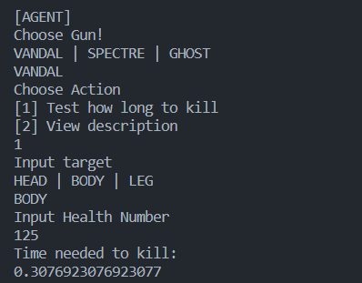

## VALORANT LIBRARY

In this application, user could traverse every detail and description of agents and guns in the game of Feloran. Everything here is updated and there is additional feature of guns where user could calculate time needed to kill an agent.

Output Example:

##### Class Used

- JETT
- YORU
- PHOENIX
- VANDAL
- SPECTRE
- GHOST

### GSLC2

##### Abstract

- Abstract class could have abstract method (Method that are similiar to interface method) and non-abstract method (For example super class method which could be called from the children method)
- A children class could only used 1 Abstract class
- Type of method and property in abstract class could use final, non-final, static and non-static variables
- Abstract class could use/inherited from Interface class

##### Interface

- Interface class could only have abstract method, thus make a guideline for the children method which method should be used
- Support multiple inheritance (children class could inherit from more than 1 interface)
- Interface only could use static and final variables
- Interface class couldn't use/get inherited by Abstract class
